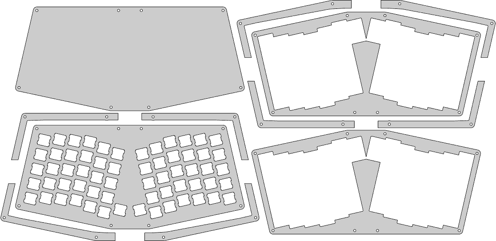

# Atreus62 Feedee

Files for my Atreus62 Feedee.

Files inside qmk_firmware are licenced under qmk_firmware licence.

# History

[I built](https://imgur.com/a/nRt54) an Atreus keyboard and, despicts being elegant, I realize it didn't match my needs.

* I needed more keys.
* I was sure I could lower the keys by one "level" (Each level is 3mm).

I started from the Atreus OpenScad files then move to what is an Atreus with 62 keys. A build log is [here](https://imgur.com/a/Bg49e).

## My notes

Teensy 2.0 (OUTEMU Brown)

    ./teensy_loader_cli  --mcu=TEENSY2 -w -v $HOME/code/repo/qmk_firmware/atreus62_feedee.hex
    # then activate reset on keyboard

Pro Micro:

Leonardo Pro Micro ATmega32U4 8MHz 3.3V (Replace ATmega328 Arduino Pro Mini D)

    ls /dev/tty*
    sudo avrdude -v -p atmega32u4 -P /dev/ttyACM0 -c avr109  -U flash:w:$HOME/code/repo/qmk_firmware/atreus62_feedee.hex -u -D

L'argument -D (Disable auto erase for flash memory) semble important.

Recently, you can use this:

    make atreus62:feedee:avrdude

Then you have:

    Detecting USB port, reset your controller now.........

Do the "reset" combination on keyboard and Pro Micro is automatically flashed:

    Detected controller on USB port at /dev/ttyACM0
    ...

# XD60 PCB as GH60

https://github.com/dorkblue/Flashing-XD-60

make xd60:feedee

dfu-programmer atmega32u4 erase --force --debug 1000
dfu-programmer atmega32u4 flash keymap.hex --debug 1000
dfu-programmer atmega32u4 reset --debug 1000

dfu-programmer atmega32u4 erase
dfu-programmer atmega32u4 flash xd60_feedee.hex 
dfu-programmer atmega32u4 reset

# melds

meld $HOME/code/repo/atreus62_feedee/qmk_firmware/keyboards/xd60 $HOME/code/repo/qmk_firmware/keyboards/xd60
meld $HOME/code/repo/atreus62_feedee/qmk_firmware/keyboards/atreus62 $HOME/code/repo/qmk_firmware/keyboards/atreus62

